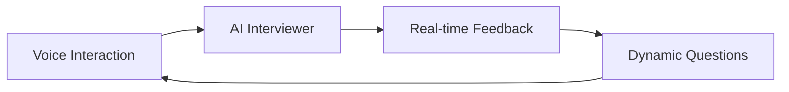
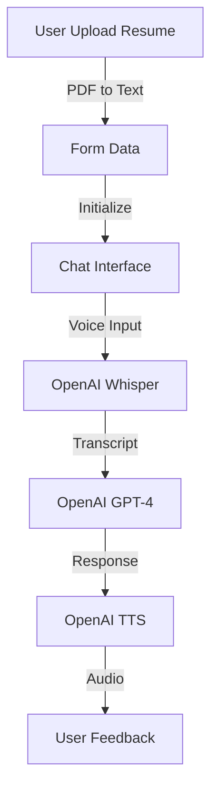

# InterviewAI 🤖 

<div align="center">
  
</div>

An AI-powered behavioral interview simulator that helps developers prepare for technical interviews through interactive voice conversations.

## ✨ Features



- 🎙️ **Natural Conversation** - Voice-based interaction for realistic interview practice
- 🤖 **AI Interviewer** - Powered by GPT-4 for intelligent questioning
- 🗣️ **Text-to-Speech** - Natural voice responses using OpenAI TTS
- 📝 **Speech-to-Text** - Real-time transcription using OpenAI Whisper
- 📄 **Resume-Aware** - Questions tailored to your experience
- 🔄 **Dynamic Follow-ups** - Contextual questions based on your responses

## 🛠️ Tech Stack

- **Frontend:** Next.js 14, TypeScript, Tailwind CSS
- **AI:** OpenAI (GPT-4, Whisper, TTS)
- **State Management:** React Hooks
- **Code Highlighting:** React Syntax Highlighter
- **Markdown:** React Markdown with GFM

## 🚀 Quick Start

1. **Clone & Install**
```bash
git clone https://github.com/yourusername/interview-ai.git
cd interview-ai
npm install
```

2. **Environment Setup**
```bash
# Copy example env file
cp .env.example .env.local

# Add your API key
OPENAI_API_KEY=your_key_here
```

3. **Run Development Server**
```bash
npm run dev
```

## 🔄 Data Flow



## 📝 Usage

1. Upload your resume (PDF format)
2. Select interview type
3. Allow microphone access
4. Start the conversation
5. Speak naturally with the AI interviewer
6. Get real-time feedback and follow-ups

## 🎯 Key Features

- **Real-time Voice Interaction**: Seamless conversation with AI interviewer
- **Code Syntax Highlighting**: Beautiful code formatting in responses
- **Markdown Support**: Rich text formatting for complex responses
- **Auto-scroll Chat**: Always see the latest messages
- **Speaking Animation**: Visual feedback during AI speech
- **Resume PDF Parsing**: Automatic extraction of resume content

## 🤝 Contributing

Contributions welcome! Please check our [Contributing Guide](CONTRIBUTING.md) for details.

## 📄 License

MIT License - see [LICENSE](LICENSE) for details.

---
<div align="center">
  Made with ❤️ by Rajea Bilal
</div>